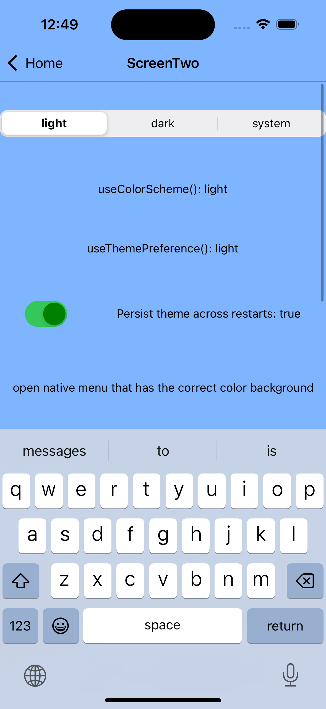
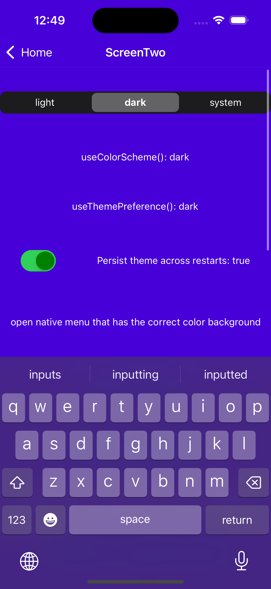
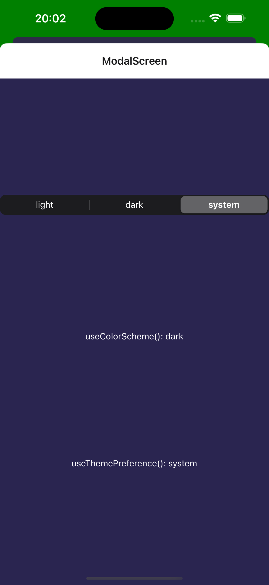

# react-native-theme-control

[](https://badge.fury.io/js/%40vonovak%2Freact-native-theme-control)
[](https://opensource.org/licenses/MIT)

Control the native platform theme from React Native with full support for both React Native Views and native UI components.

## Quick Start

```bash
npm install @vonovak/react-native-theme-control
# or
yarn add @vonovak/react-native-theme-control
```

**For Expo projects:**

```json
{
  "expo": {
    "plugins": ["@vonovak/react-native-theme-control"]
  }
}
```

**Basic usage:**

```tsx
import {
  setThemePreference,
  useThemePreference,
} from '@vonovak/react-native-theme-control';

// Set theme
setThemePreference('dark'); // 'light', 'dark', or 'system'

// Use in components
const theme = useThemePreference(); // Returns current theme preference
```

## Features

✅ **Complete Theme Control** - Control both React Native Views and native UI components (alerts, date pickers, menus)

✅ **Theme Persistence** - Automatically recovers and applies your theme **before app rendering starts rendering**

✅ **Native Integration** - Control iOS UIApplication Window and Android Activity backgrounds using [`AppBackground`](https://github.com/vonovak-org/react-native-theme-control/blob/main/docs/readme-internal.md#appbackground)

✅ **Expo Support** - Works seamlessly with Expo via config plugin

✅ **New Architecture Ready** - Full support for React Native's New Architecture

## Example

The library ensures consistent theming across your entire app - notice how the scroll bars and keyboard adapt to your theme:

| Light Mode                | Dark Mode               | Modal Background                   |
| ------------------------- | ----------------------- | ---------------------------------- |
|  |  |  |

**[View complete example project →](./example)**

## Motivation

The use case for the package is explained in a [youtube video](https://youtu.be/NNYQj_T0Sf8).

In React Native, you can use the `useColorScheme()` hook, or other functions from the `Appearance` API to get information about the system theme.

Note: as of RN 72, the following paragraph isn't true anymore (there is `setColorScheme` now). However, RN does not maintain the selected color scheme across restarts and doesn't contain other goodies in this package.

Using that information, you can then render your Views in dark or light mode design. However, that information is read-only: you cannot influence what the `useColorScheme()` hook returns. What if you want to allow the user to choose the application theme? React Native core does not directly expose the APIs to do so.

You might follow one of the many blog posts for theming React Native apps such as [here](https://blog.logrocket.com/comprehensive-guide-dark-mode-react-native/#dark-mode-react-native-using-context-api) or [here](https://medium.com/@ratebseirawan/react-native-dark-mode-done-right-13f83b39a4ca). The approach taken by the guides is to store the application theme in the JavaScript part of your app. However, this can easily leave your users with a broken experience because while the React Native views will be rendered correctly, the native views (Alert, Document picker, Date picker, Menu...) will not.

This package provides a solution to change the application theme so that both react native and native components use the same theme - see the [relevant part of the video](https://youtu.be/NNYQj_T0Sf8?t=73).

## Documentation

- **[📖 Installation Guide](./docs/install.md)** - Complete setup instructions
- **[🔧 API Reference](./docs/readme-internal.md)** - Detailed API documentation
- **[💡 Example Project](./example)** - Working implementation
- **[🎥 Video Tutorial](https://youtu.be/NNYQj_T0Sf8)** - See it in action

## Common Issues

**Android activity restarts on theme change?** → [See solution](./docs/install.md#android-activity-restarts-upon-theme-change)

**Scroll bars not changing color?** → [See solution](./docs/install.md#android-scroll-bars-color-is-not-changing)

**Need help?** → [Open an issue](https://github.com/vonovak-org/react-native-theme-control/issues)

## Support

If you find this library useful, consider:

- ⭐ **Starring the repository**
- 💖 **[Sponsoring the project](https://github.com/sponsors/vonovak)**
- 🐛 **[Reporting issues](https://github.com/vonovak-org/react-native-theme-control/issues)**

## Credits

Some naming inspiration for the Android Navbar components was taken from [react-native-bars](https://github.com/zoontek/react-native-bars).

## License

MIT
